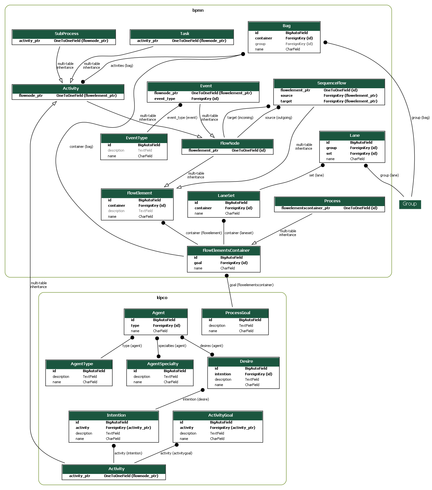

# SFDjango

Funcionalidades atuais:

- Arquitetura do banco de dados segue o proposto (doc/files/proposal.docx) para suprir necessidades de processos estruturados e não estruturados
- Abertura externa por APIs, para todos os objetos nos apps "bpmn" e "kipco"
  - create
  - read
  - update
  - delete 

Próximos passos:

- [ ] Com base no documento descritivo do projeto (doc/files/project.docx), preencher bags of activities
- [ ] Bag of activities com reasoning do owlready
- [ ] Abertura/andamento de processos por meio de APIs

Executando o projeto:

- Docker Compose
  - docker-compose build
  - docker-compose up 

- Visual Code
  - Abrir em modo Container
  - no terminal: ./runDevMode.sh

Usuário Administrador Padrão:

- http://localhost:8000
- Usuário: admin
- Senha: admin

